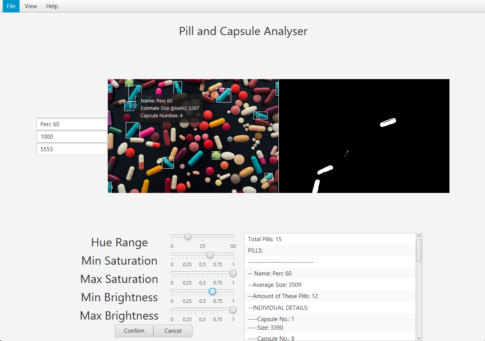
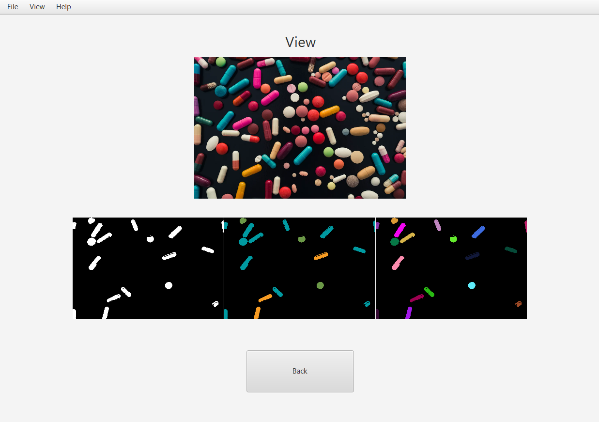

# Pill &amp; Capsule Analyser
Pill &amp; Capsule Analyser for CA1 of Data Structures &amp; Algorithms 2 (Year 2, Semester 2, 93%)
Assignment Spec shown in spec.pdf.

## Overview
This is a JavaFX application that analyses images of pills and capsules, allowing the user to identify and label such these pills. The application provides options for uploading images, filtering the pills in the image by clicking on them in the image itself and adjusting size and HSB values to match a desired output.
The core of the image conversion utilizes the Union-Find algorithm (union by size) where each pixel on the image is it's own disjoint set. These are then unioned together based on their surrounding pixels.




## Features
- **Pill Filtering**: Filter pills by clicking on the desired pill in the image (based on size (in pixels) and min and max HSB values).
- **Pill Labelling**: Confirm the name of a specific type of pill.
- **Pill Counting**: Get an accurate count of the number of pills that have been confirmed in the system.
- **Pill Highlighting**: Highlight confirmed pills in the image by clicking on them (draws rectangles around them and numbers them sequentially).
- **Pill View**: View all the pills on the system in a separate view.
- **JMH Benchmarking**: Benchmark methods within the assignment.
- **Two-Tone Pill Recognition**: Filter two-tone pills in separate tab (CURRENTLY NOT WORKING).

## Setup
Run this command in the terminal after cloning the repository:
  ```bash
  mvnw clean verify build 
  ```
Make sure the application compiles in your software.
